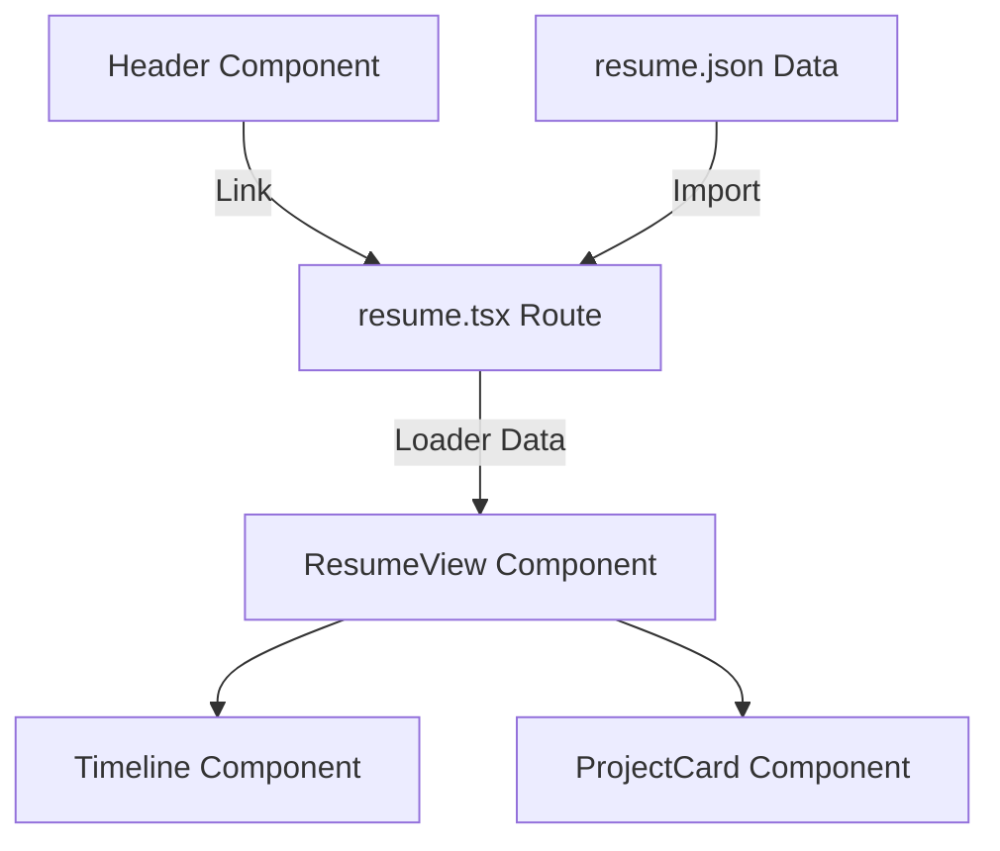

# Technical Design Document - Career and Resume Consolidation

## Overview
本機能は、ポートフォリオサイト内の「職務経歴（`/career`）」と「経歴・実績（`/resume`）」の重複ページを一本化し、閲覧者が迷うことなく最新の職歴情報へアクセスできるように改善します。
また、リポジトリに具体的な会社名や商標を残さずに、最新のスキルセットおよび経験情報を適切に公開するためのデータ・UI設計を行います。

### Goals
- `/career` ルートへのアクセスを `/resume` へ自動的にリダイレクトする。
- ヘッダーナビゲーションから「職務経歴」のリンクを削除し、「経歴・実績（`/resume`）」のみに整理する。
- 職務要約、活かせる経験・知識・技術、自己PR、および複数プロジェクト構造を持つ詳細な職歴データを定義・表示する。
- すべての経歴データを完全に匿名化（一般化）し、パブリックなリポジトリに機密情報や固有名詞をコミットさせない。

### Non-Goals
- `/works`（実績紹介）ページの変更。
- スキルレベルを視覚的に表現するRPG風のアニメーション付きレーダーチャートの作成（これらは別仕様 `rpg-skillsheet` にてスコープ化されるため、本仕様ではデータ定義と基本的なテキスト表示のみを行う）。

## Boundary Commitments

### This Spec Owns
- `/career` から `/resume` へのクライアントサイドでのルートリダイレクト処理。
- ナビゲーションメニュー（`Header.tsx`）の整理。
- `ResumeData` に定義される新規データ構造（職務要約、スキルカテゴリ、自己PR、詳細職歴）の追加。
- 一般化された職歴データファイル `resume.json` の管理。
- 経歴・スキル情報を適切にレイアウトして描画する `ResumeView` および `Timeline` コンポーネントの構造。

### Out of Boundary
- `/works` にあるプロジェクト詳細の修正。
- 動的なデータベース連携やサーバーサイドでのリダイレクト処理（ホスティングが GitHub Pages であるため静的配信の枠内で解決する）。
- スキルビジュアライザ（レーダーチャートなどの動的なグラフィックス）の実装。

### Allowed Dependencies
- `@tanstack/react-router`（リダイレクト処理およびルート定義）
- `@tanstack/react-start`（静的プレレンダリング）

### Revalidation Triggers
- `ResumeData` のスキーマ（TypeScript型定義）の変更。
- ルート構成やベースパス設定の変更。

## Architecture

### Existing Architecture Analysis
- 既存のポートフォリオは、Vite + React 19 + TanStack Router (TanStack Start) で構築されており、ビルド時に全ルートがプリレンダリング（SSG）される。
- 職務経歴関連の情報は、一部が `careerData.json`（古い職歴情報）から、一部が `resume.json`（ダミーの構造化データ）から読み込まれて散発的に表示されている。
- 今回の設計では、データソースを `resume.json` に完全に一本化し、旧 `/career` ルートをリダイレクト化することで、アーキテクチャのクリーンアップを図る。

### Architecture Pattern & Boundary Map



## File Structure Plan

### Directory Structure
```
src/
├── components/
│   └── layout/
│       └── Header.tsx          # Modified: ナビゲーション整理
├── content/
│   └── resume.json             # Modified: 匿名化された最新の経歴データの配置
├── features/
│   └── resume/
│       ├── components/
│       │   ├── ResumeView.tsx  # Modified: 新レイアウト（要約、スキル、PR、職歴）
│       │   └── Timeline.tsx    # Modified: 階層的な職歴（CompanyProject）の描画
│       └── types.ts            # Modified: スキル、PR、複数プロジェクトに対応した型定義
└── routes/
    ├── career.tsx              # DELETE: 不要になった旧ルートを削除
    └── resume.tsx              # Unchanged: loader経由で更新されたデータを受け渡し
```

### Modified Files

- `[DELETE] src/routes/career.tsx` — `/career` のルート定義を削除し、NotFound挙動にする。
- `src/components/layout/Header.tsx` — ナビゲーション項目 `NAV_ITEMS` から `/career` の項目を削除する。
- `src/features/resume/types.ts` — スキル情報、自己PR、ネストしたプロジェクト情報に対応した型を定義する。
- `src/content/resume.json` — 固有名詞を含まない最新の職務経歴情報（ECサービス運営企業、Unityハイブリッドアプリ開発、BD-J規格システム開発など）を配置する。
- `src/features/resume/components/ResumeView.tsx` — 要約・スキル・自己PRを含むリッチなページレイアウトにアップデートする。
- `src/features/resume/components/Timeline.tsx` — 会社ごとのサブプロジェクト（`CompanyProject`）をレンダリングできるようにリスト構造を二重ループに拡張する。

## Requirements Traceability

| Requirement | Summary | Components | Interfaces | Flows |
|-------------|---------|------------|------------|-------|
| 1.1 | ナビゲーションメニューの「職務経歴」を非表示にする | Header | | |
| 1.2 | `/career` へのアクセス時は NotFound とする | | | |
| 1.3 | 経歴情報を `/resume` に集約する | ResumeView | | |
| 2.1 | 職務要約、スキル、職歴、自己PRを表示する | ResumeView | ResumeData | |
| 2.2 | 3つのキャリア期間（ECサービス、ゲーム・新規事業、初期キャリア）を表示する | Timeline | Company | |
| 2.3 | 各項目に技術スタックを表示する | Timeline | CompanyProject | |
| 3.1 | 実在する企業名や商標（PlayStation、Blu-rayなど）を一般化する | resume.json | | |
| 3.2 | ソースコード上に具体的な企業名や非公開製品名を含めない | resume.json | | |
| 4.1 | ビルド時に静的生成（SSG）される | Vite / Prerender | | |
| 4.2 | 初回表示時にサーバーサイド・外部通信を不要とする | ResumeRoute | | |

## Components and Interfaces

### UI Components

| Component | Domain | Intent | Req Coverage | Key Dependencies | Contracts |
|-----------|--------|--------|--------------|------------------|-----------|
| Header | Layout | ナビゲーションメニューの描画と `/career` リンクの除外 | 1.1 | `@tanstack/react-router` | None |
| ResumeView | Resume | 経歴・実績ページのルートコンポーネント。各セクションのレイアウト。 | 1.3, 2.1 | Timeline, ProjectCard | State |
| Timeline | Resume | 職歴情報のタイムライン表示。サブプロジェクト構造をレンダリング。 | 2.2, 2.3 | None | State |

#### ResumeView
- **Intent**: スキルシート（経歴・実績）の全体レイアウトを構成する。
- **Requirements**: 1.3, 2.1
- **State**:
  ```typescript
  interface ResumeViewProps {
    data: ResumeData;
  }
  ```

#### Timeline
- **Intent**: 職歴をタイムライン形式で可視化する。各企業の配下にあるサブプロジェクト（`CompanyProject`）を入れ子で描画する。
- **Requirements**: 2.2, 2.3
- **State**:
  ```typescript
  interface TimelineProps {
    companies: Company[];
  }
  ```

## Data Models

### Domain Model (types.ts)

```typescript
export interface CompanyProject {
  title: string;
  period?: string;
  details: string[];
}

export interface Company {
  name: string;
  period: string;
  role: string;
  projects?: CompanyProject[]; // 拡張：会社内の複数プロジェクト
  details?: string[]; // 互換性のための残存（または移行完了後に削除）
}

export interface SkillCategory {
  category: string;
  skills: string[];
}

export interface Project {
  title: string;
  description: string;
  tech: string[];
  github?: string;
}

export interface ResumeData {
  introduction: string; // 職務要約
  skills: SkillCategory[]; // 活かせる経験・知識・技術
  companies: Company[]; // 職務経歴
  projects: Project[]; // 個人プロジェクト実績（既存）
  pr: string; // 自己PR
}
```

## Error Handling

### Error Strategy
- データファイル（`resume.json`）の読み込みエラーや形式不一致：
  - ビルド時に TypeScript コンパイルエラー（tsc）として検出し、デプロイ前にビルドを失敗させる（Fail Fast）。
- ルートリダイレクトエラー：
  - TanStack Router のリダイレクト失敗時は、フォールバックルートにより自動的にルートページへ流す。

## Testing Strategy

### Automated Tests
- **Type Check**:
  - `bun typecheck` (tsc) を実行し、データ構造の整合性とコンポーネントPropsの型安全性を検証する。
- **Linter & Code Quality**:
  - `bun lint` (Biome) を実行し、コードの健全性とルール適合性を確認する。
- **Build / SSG Validation**:
  - `bun run build` を実行し、SSGクロール中にエラーなく全HTMLファイル（`/resume` や `/career` 用ファイルなど）が静的に生成されるかを確認する。

### Manual Verification
- ローカル開発サーバー（`bun dev`）を起動し、以下をブラウザでテストする。
  1. ナビゲーションメニューに「職務経歴」が含まれず、「経歴・実績」のみが表示されていること。
  2. 直接 `http://localhost:3000/career` へアクセスした際、即座に `http://localhost:3000/resume` へリダイレクトされること。
  3. `/resume` ページに「自己紹介/職務要約」「活かせる技術」「自己PR」「職務経歴（ECサービス運営企業、ゲーム開発、初期キャリアの3大区分）」が正しく描画されていること。
  4. 職務経歴タイムラインの中に、サブプロジェクト（Web版リプレイス開発など）が入れ子で表示され、各社での技術スタックが明記されていること。
