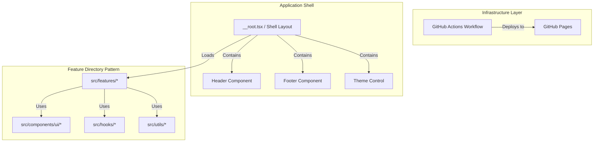

# Design Document: infrastructure

## Overview
本ドキュメントは、ポートフォリオサイト全体の基盤となるディレクトリ構成、Vite および TanStack Start/Router による静的プレレンダリング（SSG）設定、Tailwind CSS v4 によるデザインシステム、そして自動デプロイパイプラインの設計を定義します。

### Goals
- プロダクションレベルの美しく保守しやすいディレクトリ設計の確立
- Tailwind v4 によるダークモード対応の洗練されたデザインシステムの定義
- GitHub Pages（静的配信）で動作する完全な SSG 設定と自動デプロイ
- 静的検証（Biome, Markuplint）および型チェックが常時通過する環境の維持

### Non-Goals
- 個別のビジネスロジックや詳細UIの実装
- Storybook サーバーの立ち上げ

## Boundary Commitments

### This Spec Owns
- プロジェクト共通のディレクトリ構造および設定ファイル群（Vite, Biome, Markuplint, Lefthook）
- グローバルCSSスタイル定義およびデザインシステムトークン
- アプリ全体のレイアウトコンポーネント（ヘッダー、フッター、レイアウトシェル）
- GitHub Actions デプロイワークフロー
- ルーティングの基本エントリーポイント（`src/routes/__root.tsx` など）

### Out of Boundary
- 各画面（職務経歴、GitHub連携など）に特化した個別コンポーネントおよびデータソース

### Allowed Dependencies
- **ランタイム**: React 19, TanStack Start/Router, Tailwind CSS v4, Lucide React (アイコン用)
- **インフラ**: GitHub Pages, GitHub Actions
- **静的解析**: Biome, Markuplint, TypeScript (tsc)

### Revalidation Triggers
- アセットのルートディレクトリ変更、Base URL の変更
- ルーティングのベースシェル（`__root.tsx`）の構造変更
- Tailwind v4 のグローバル変数のキー名変更

## Architecture

### Architecture Pattern & Boundary Map


### Technology Stack

| Layer | Choice / Version | Role in Feature | Notes |
|-------|------------------|-----------------|-------|
| Frontend | React 19 / TanStack Start | メタフレームワーク / ルーティング / SSG | 静的ターゲットビルド |
| Styling | Tailwind CSS v4 | CSS-first デザインシステム | CSS Variablesベース |
| Lint / Format | Biome / Markuplint | 品質検証・アクセシビリティ担保 | CI及びコミット前フックで実行 |
| CI / CD | GitHub Actions | 自動ビルド＆GitHub Pagesデプロイ | `actions/deploy-pages` 使用 |

## File Structure Plan

### Directory Structure
```
.github/
└── workflows/
    └── deploy.yml          # GitHub Pages 自動デプロイ
.kiro/
├── steering/
│   └── roadmap.md          # 開発ロードマップ
└── specs/
    └── infrastructure/     # 本スペック
src/
├── components/
│   └── ui/                 # 汎用UIパーツ（ボタン、カード等）
├── features/               # 機能別モジュール（現在は空）
├── hooks/                  # 汎用フック
├── routes/
│   ├── __root.tsx          # アプリ全体のシェルレイアウト
│   └── index.tsx           # トップページエントリー
├── utils/                  # 汎用ユーティリティ
├── entry-client.tsx        # クライアントエントリー
├── entry-server.tsx        # サーバーエントリー（ビルド時にSSGで使用）
└── global.css              # Tailwind v4 の設定とグローバルCSS
```

### Modified / New Files
- **[NEW]** `.github/workflows/deploy.yml` — デプロイパイプライン
- **[NEW]** `src/global.css` — Tailwind v4 およびデザインシステムトークンの定義
- **[MODIFY]** `src/routes/__root.tsx` — 基本レイアウトシェルの実装
- **[MODIFY]** `vite.config.ts` — SSG ビルドおよびベースパス設定

## Components and Interfaces

| Component | Domain/Layer | Intent | Req Coverage | Key Dependencies |
|-----------|--------------|--------|--------------|------------------|
| RootLayout | Shell Layout | アプリ全体のヘッダー、フッター、テーマ制御を含む外枠を提供 | Req 2.2, 2.3 | ThemeProvider |
| ThemeToggle | UI / Common | ライト/ダークモードのトグルスイッチ | Req 2.3 | Lucide React |

### RootLayout
`src/routes/__root.tsx` に実装され、共通のナビゲーションやフッターを内包します。

### ThemeToggle
ダークモードの切り替え制御を行います。`document.documentElement.classList` に `dark` クラスを付与/削除するシンプルな構成にします。

## Error Handling
- 静的生成時のビルドエラー: CI上でビルドコマンドが失敗（exit code 1）した場合にデプロイをブロックし、通知を行います。
- クライアントサイドルーティングエラー: 存在しないパスへのアクセス時は、TanStack Router の `NotFoundRoute` でカスタムエラーページを表示します。

## Testing Strategy
- **静的チェック**: Biome (`bun run lint`) および Markuplint (`bun run lint:markup`) が正常にパスすること。
- **ビルドテスト**: ローカル環境で `bun run build` を実行し、`dist/` 配下に静的ファイル群が正常に出力されることを検証します。
